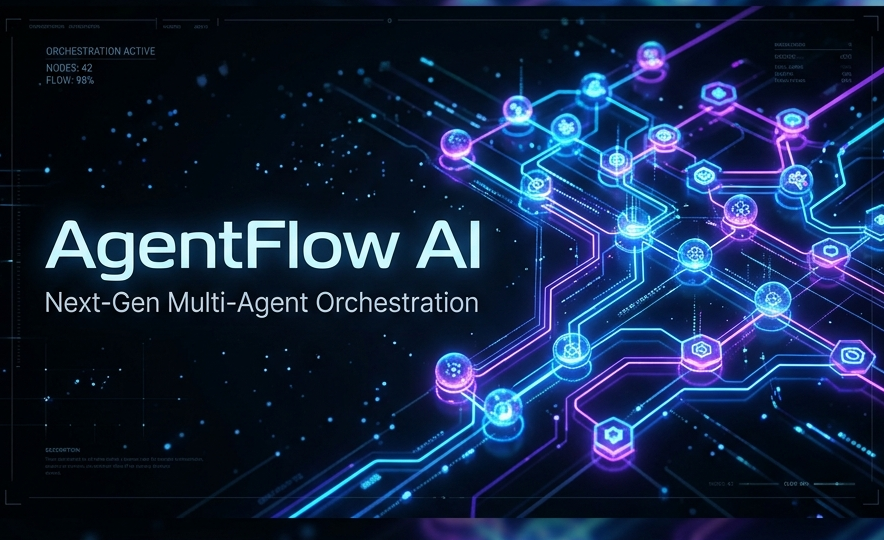
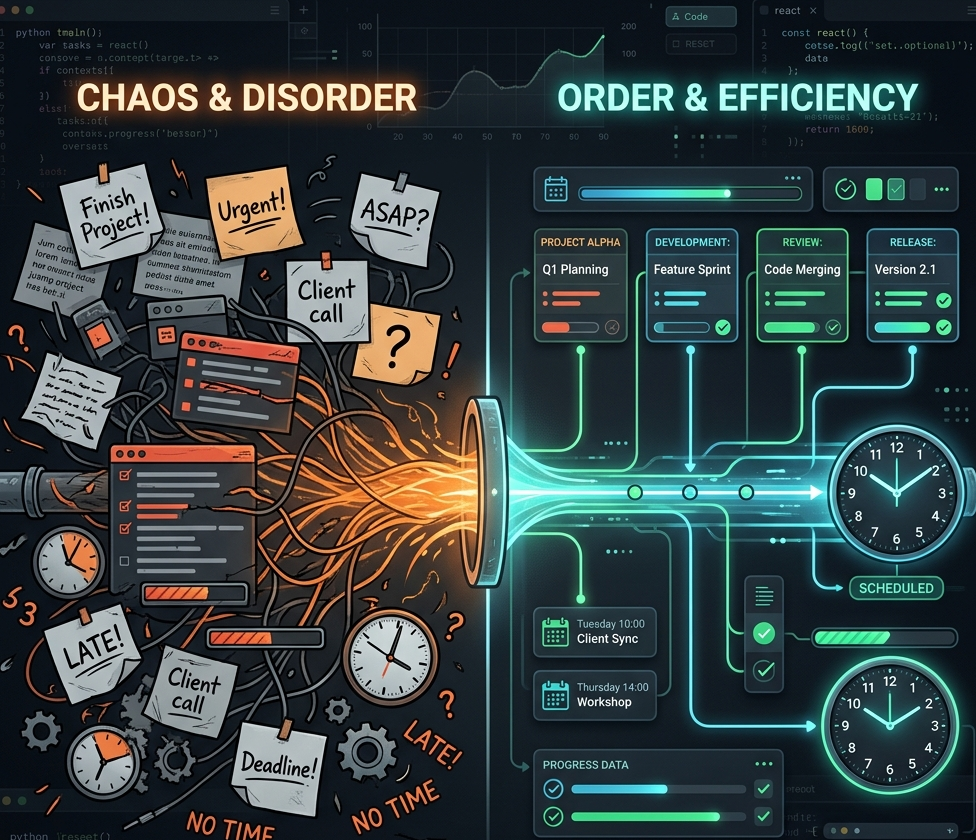
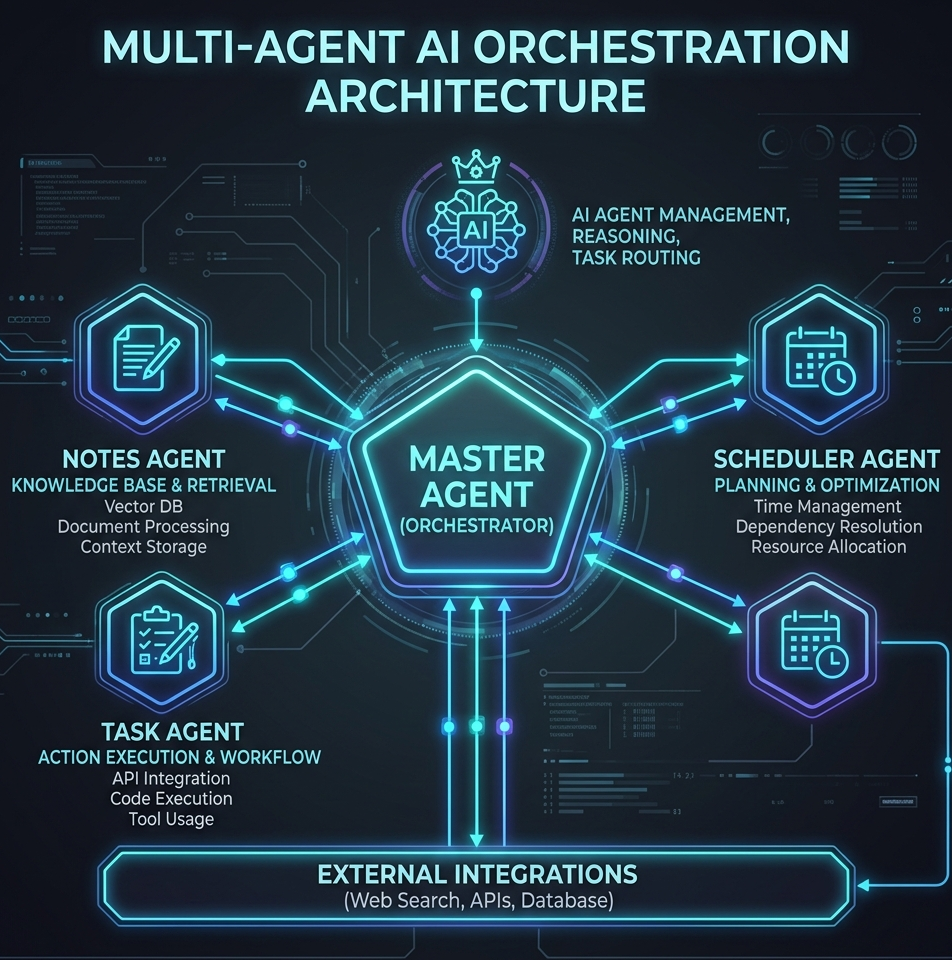

<div align="center">
  

  # AgentFlow AI

  **Multi-agent intelligence that converts high-level goals into structured, executable workflows.**

  [](https://python.org)
  [](https://fastapi.tiangolo.com)
  [](LICENSE)
  [](https://agentflow-api-rln6tjgjsq-el.a.run.app/health)
</div>


> **AgentFlow AI is an API-first multi-agent system that takes your goal and returns a full execution plan.**
> It produces context-aware tasks, scheduled time slots, and a structured machine-readable response suitable for frontend and automation use.

---

## 🛑 The Real World Problem vs The AgentFlow Solution

Most productivity tools and AI assistants fail at the last mile. Users are forced to manually break goals down, scheduling is completely disconnected, and outputs are hard to execute immediately.

<div align="center">
  
</div>

### 💡 How AgentFlow Fixes This
Through coordinated agents, tool integrations, and persistent memory:
1. **Understands The Goal** — Converts a high-level objective into execution context.
2. **Retrieves Memory (RAG)** — Uses FAISS vector search to inject relevant past notes.
3. **Generates Tasks** — Produces actionable tasks with priority and effort estimates.
4. **Reserves The Time** — Allocates practical schedule blocks via calendar bindings.
5. **Returns Pure JSON** — Ready for any frontend GUI or internal automation tool.

---

## 🧠 System Architecture

AgentFlow is a state-driven multi-agent topology using **LangGraph**.

<div align="center">
  
</div>

### Multi-Agent Hierarchy
- 👑 **Master Agent**: Validates input, selects strategy, and orchestrates.
- 📚 **Notes Agent**: Uses vector memory to pull historical context.
- ⚙️ **Task Agent**: Persists actionable steps in SQLite.
- 🗓️ **Scheduler Agent**: Maps tasks to actual available time blocks.
- 🚀 **Execution Agent**: Summarizes execution and packages the API payload.

### Robust Reliability Under The Hood
- **Retry + Exponential Backoff** for external model calls.
- **Failover Chain**: Uses a hierarchy of primary models, gracefully falling back to simpler models if needed.
- **Deterministic Fallback**: Can produce a basic plan even when all LLMs fail.

---

## ⚙️ Tech Stack

| Layer | Technology |
|---|---|
| **Backend API** | FastAPI (Python) |
| **Agent Core** | LangGraph, OpenRouter |
| **Relational DB** | SQLite + SQLAlchemy |
| **Vector Search (RAG)** | FAISS |
| **Hosting** | Google Cloud Run |
| **Frontend** | Pure HTML/CSS/JS (Served by FastAPI) |

---

## 🚀 Live Demo & API Usage

**View the Live Demo:** [AgentFlow Live Frontend](https://agentflow-api-rln6tjgjsq-el.a.run.app/frontend/) <br>
**Check the Docs:** [Swagger UI](https://agentflow-api-rln6tjgjsq-el.a.run.app/docs)

### API Example
Submit a high-level goal directly to the execute endpoint.

```bash
curl -X POST "https://agentflow-api-rln6tjgjsq-el.a.run.app/api/v1/execute" \
  -H "Content-Type: application/json" \
  -d '{"user_id":1,"goal_text":"Prepare for final exams in 2 days"}'
```

<details>
<summary><b>Click to expand full JSON Output</b></summary>

```json
{
  "status": "success",
  "goal": "Prepare for final exams in 2 days",
  "task_breakdown": [
    {"title": "Understand the scope", "priority": "high", "estimated_minutes": 45},
    {"title": "Focused implementation session", "priority": "high", "estimated_minutes": 60},
    {"title": "Review and revision", "priority": "medium", "estimated_minutes": 30}
  ],
  "scheduled_events": [
    {"task_title": "Understand the scope", "slot": "2026-04-06T10:00:00"},
    {"task_title": "Focused implementation session", "slot": "2026-04-06T11:00:00"}
  ],
  "planner_diagnostics_summary": {
    "total_attempts": 1,
    "successful_model": "anthropic/claude-3.5-sonnet"
  }
}
```
</details>

---

## 🛠️ Local Setup

1. **Clone & Virtual Env:**
   ```bash
   git clone https://github.com/Abhichy18/AgentFlow-AI.git
   cd AgentFlow-AI
   python -m venv .venv
   ```
   *Windows:* `.\.venv\Scripts\Activate.ps1` | *Mac/Linux:* `source .venv/bin/activate`

2. **Dependencies & Env:**
  ```bash
  pip install -r requirements.txt
  ```
  Windows PowerShell:
  ```powershell
  Copy-Item .env.example .env
  ```
  Mac/Linux:
  ```bash
  cp .env.example .env
  ```
  Edit .env and supply OPENROUTER_API_KEY.

3. **Initialize DB & Run:**
   ```bash
   python -m memory.init_db
   uvicorn api.main:app --reload --port 8000
   ```

---

## 📁 Project Structure

```text
api/                FastAPI entrypoints and routes
agents/             Specialist agent node implementations
workflows/          LangGraph workflow construction
memory/             SQLite and FAISS memory utilities
tools/              MCP-style wrappers (notes, tasks, calendar)
frontend/           Static UI (HTML/CSS/JS)
tests/              API-level tests
assets/             README and UI image assets
```

---

## 🧪 Testing & Quality Checks

Run the test suite:

```bash
pytest -q
```

Current checks validate core API behavior, including:
- Health endpoint response
- Invalid request handling
- Goal execution endpoint success path

---

## 🧷 Runtime & Dependency Policy

- **Python runtime target:** 3.10+
- **Dependency management:** `requirements.txt` (unpinned major/minor ranges)
- **Environment variables:** configured through `.env` for local development and Secret Manager in Cloud Run

For production hardening, add a pinned lockfile and automated dependency updates.

---

## ⚠️ Known Limitations

1. Calendar scheduling currently uses a mock provider, not live Google Calendar OAuth.
2. SQLite is suitable for demo and low-concurrency scenarios; production should migrate to PostgreSQL.
3. Authentication and user-level access control are not yet enabled.
4. Test coverage is focused on API behavior and does not yet include deep workflow integration tests.

---

## 🔮 Roadmap
- [ ] Connect absolute Google Calendar OAuth bindings.
- [ ] Implement fully durable PostgreSQL support.
- [ ] Add JWT Authentication.
- [ ] Build an execution Analytics Dashboard.

---
<p align="center">
  <b>Built by AgentFlow Labs - Abhishek Choudhary</b><br>
  <i>Taking Agentic AI to the edge.</i>
</p>
